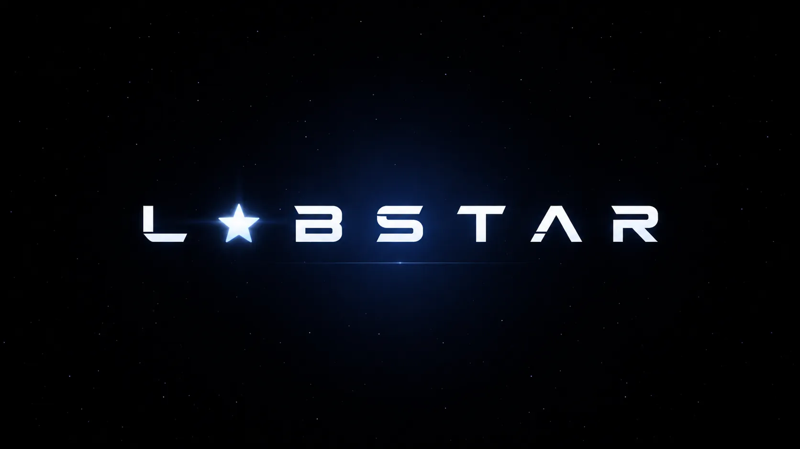

<p align="center">
  
</p>

<h1 align="center">LABSTAR</h1>

<p align="center">
  <strong>A developer-first business workspace where communication, code, projects and operations stay in the same orbit.</strong>
</p>

<p align="center">
  🌌 <a href="#mission">Mission</a> ·
  🪐 <a href="#product-universe">Product Universe</a> ·
  🚀 <a href="#architecture">Architecture</a> ·
  ✨ <a href="docs/LABSTAR_EVOLUTION_ROADMAP.md">Evolution Roadmap</a> ·
  🌍 <a href="docs/INTERNATIONAL_RELEASE_ROADMAP.md">International Roadmap</a> ·
  🛰️ <a href="docs/README.md">Docs</a>
</p>

<p align="center">
  <a href="https://labstar.pages.dev/">Web App</a> ·
  <a href="CONTRIBUTING.md">Contributing</a> ·
  <a href="SECURITY.md">Security</a> ·
  <a href="docs/legal/TERMS_OF_USE_DRAFT.md">Terms</a> ·
  <a href="docs/legal/PRIVACY_NOTICE_DRAFT.md">Privacy</a>
</p>

<p align="center">
  
  
  
  
  
</p>

---

## 🌌 Mission

**Labstar** is a business collaboration platform developed by **Hepter Studios** for teams that build software and run companies around that work.

The product is evolving beyond a private internal tool into a **public, multi-organization platform**. The key model is simple:

> **Labstar can be public. Your organization is not.**

The application, documentation and product evolution can be visible publicly while each organization keeps its channels, members, projects, repositories, operational data and internal activity isolated by default.

Labstar is being built around one idea: **keep people, code, context and execution together**.

---

## 🪐 Product Universe

| Orbit | What lives there |
| --- | --- |
| 🌎 **Organizations** | private company spaces, teams, roles, permissions and membership |
| 💬 **Communication** | channels, direct messages, realtime presence, voice/video direction and notifications |
| 🧑‍🚀 **People** | members, squads, roles, availability and identity connections |
| 💻 **Developer Workflows** | GitHub activity, pull requests, reviews, CI events and developer-focused navigation |
| 🛰️ **Projects & Operations** | projects, operational context, integrations, alerts and business workflows |
| ⚡ **Desktop Experience** | Tauri 2 + Rust, native notifications, deep links and future global shortcuts |
| 🌐 **Public Layer** | optional public developer profiles and product surfaces that never expose private organization data by default |

### Public product, private organizations

The target security boundary is **organization-first isolation**:

- organization content is private by default;
- membership and authorization are enforced by the backend, not trusted to the UI;
- external integrations receive only the permissions they need;
- public developer profiles, when introduced, are explicit opt-in;
- public visibility of this repository does **not** make customer or organization data public.

---

## ✨ Why Labstar is becoming developer-first

The next product cycle is focused on making Labstar something a programmer wants to install voluntarily — not merely software a company requires them to use.

The roadmap includes:

1. **GitHub Organization Integration** — import teams, members, repositories and permissions instead of rebuilding company structure manually.
2. **Command Palette** — `Cmd+K` / `Ctrl+K` navigation across squads, people, PRs, settings and actions.
3. **GitHub Pulse** — realtime push, PR, review and CI activity inside Labstar with native desktop notifications.
4. **Labstar CLI** — a terminal companion for login, status, PRs, squads and deep-linking into the desktop app.
5. **Automatic PR War Rooms** — contextual rooms created around PRs and failed CI runs.
6. **Public Developer Profiles** — verified GitHub-backed profiles, always opt-in and separated from private company data.
7. **Context Graph / Project Memory** — connect code, PRs, incidents, decisions, docs and conversations into searchable project memory.
8. **Developer Platform & Automations** — APIs, webhooks, integrations and an extension surface so Labstar can become a platform, not a closed app.

See the full implementation order, dependencies and rationale in the **[Labstar Evolution Roadmap](docs/LABSTAR_EVOLUTION_ROADMAP.md)**.

---

## 🚀 Current Technology

Current application version: **`11.2.9`**.

| Area | Technology / direction |
| --- | --- |
| Web / PWA | React 19 + TypeScript + Vite |
| Desktop | Tauri 2 + Rust |
| Backend | Rust + Axum |
| Authentication | Supabase Auth + connected identity providers |
| Database | PostgreSQL / Supabase |
| Realtime | Supabase Realtime |
| Storage | Supabase Storage |
| Web deployment | Cloudflare Pages |
| API deployment | Fly.io |

> Labstar is under active development. Public repository visibility is not the same thing as a finished public commercial release.

---

## 🛰️ Architecture

```text
                              ✦ LABSTAR ✦
                                   │
                 ┌─────────────────┴─────────────────┐
                 │                                   │
            Web / PWA                          Desktop App
     React 19 + TypeScript                  Tauri 2 + Rust
                 │                                   │
                 └─────────────────┬─────────────────┘
                                   │
                            Rust / Axum API
                                   │
                  ┌────────────────┼────────────────┐
                  │                │                │
                Auth          PostgreSQL        Realtime
                  │                │                │
                  └────────────── Storage ──────────┘
                                   │
                         Organization Boundary
                                   │
                     GitHub / future integrations
```

### Architecture principles

- backend authorization is the source of truth for protected operations;
- organization boundaries must be explicit in data, API and Realtime policies;
- desktop and web share product logic without duplicating critical authorization rules;
- external integrations use least privilege;
- public surfaces consume deliberately aggregated or opt-in data rather than private organization records.

---

## 🌠 Repository Constellation

```text
.
├── src/             # React application and product UI
├── src-tauri/       # Tauri 2 desktop application
├── backend/         # Rust/Axum backend
├── supabase/        # Database, migrations and Supabase resources
├── public/          # Public web assets
├── docs/            # Product, architecture, operations and roadmap docs
├── scripts/         # Build and maintenance scripts
└── .github/         # CI and repository workflows
```

### Explore the docs

| Destination | Document |
| --- | --- |
| ⭐ Product evolution | [`docs/LABSTAR_EVOLUTION_ROADMAP.md`](docs/LABSTAR_EVOLUTION_ROADMAP.md) |
| 🌍 International release | [`docs/INTERNATIONAL_RELEASE_ROADMAP.md`](docs/INTERNATIONAL_RELEASE_ROADMAP.md) |
| 🗺️ Documentation index | [`docs/README.md`](docs/README.md) |
| 🧭 Product completion map | [`docs/PRODUCT_COMPLETION_MAP.md`](docs/PRODUCT_COMPLETION_MAP.md) |
| 🏗️ Architecture decisions | [`docs/ARCHITECTURE_DECISIONS.md`](docs/ARCHITECTURE_DECISIONS.md) |
| 🔐 Security policy | [`SECURITY.md`](SECURITY.md) |
| 🤝 Contributing | [`CONTRIBUTING.md`](CONTRIBUTING.md) |
| 🌱 Community conduct | [`CODE_OF_CONDUCT.md`](CODE_OF_CONDUCT.md) |
| ⚖️ Terms draft | [`docs/legal/TERMS_OF_USE_DRAFT.md`](docs/legal/TERMS_OF_USE_DRAFT.md) |
| 🛡️ Privacy draft | [`docs/legal/PRIVACY_NOTICE_DRAFT.md`](docs/legal/PRIVACY_NOTICE_DRAFT.md) |

---

## 🔭 Local Development

### Requirements

- Node.js 22
- npm
- Rust 1.85+ for desktop/backend development

### Web

```bash
git clone https://github.com/hepter-studios/Labstar.git
cd Labstar
npm ci
cp .env.example .env.local
npm run dev
```

On Windows PowerShell:

```powershell
Copy-Item .env.example .env.local
npm run dev
```

Build the web application:

```bash
npm run build
```

Build the desktop application:

```bash
npm run desktop:build
```

Never place credentials, service-role keys, OAuth client secrets or production tokens in frontend variables or committed files.

---

## 🌍 Roadmaps

Labstar has two complementary roadmaps:

- **[Evolution Roadmap](docs/LABSTAR_EVOLUTION_ROADMAP.md)** — developer adoption, GitHub-native workflows, CLI, realtime, War Rooms, public profiles, Context Graph and extension platform.
- **[International Release Roadmap](docs/INTERNATIONAL_RELEASE_ROADMAP.md)** — multi-organization isolation, desktop distribution, i18n, global infrastructure, legal readiness and commercial launch.

The two roadmaps intentionally meet at the same product model: **a public Labstar platform with private-by-default organizations**.

---

## 🔐 Trust, Privacy & Source Visibility

This repository is publicly visible for product transparency and development visibility.

**No software license is currently included.** Public source visibility alone does not grant permission to copy, redistribute, relicense or commercially reuse the code.

Organization data is a separate concern from repository visibility. The product direction is to keep private workspace data isolated while allowing selected public product surfaces only when intentionally enabled.

Public legal documents in this repository are currently **pre-release drafts** and require professional legal review before a commercial launch:

- [Terms of Use — Draft](docs/legal/TERMS_OF_USE_DRAFT.md)
- [Privacy Notice — Draft](docs/legal/PRIVACY_NOTICE_DRAFT.md)
- [Security Policy](SECURITY.md)

---

## 🤝 Contributing

Labstar is developed in public, but contribution scope is still curated while the architecture evolves quickly.

Before opening a substantial pull request, read **[CONTRIBUTING.md](CONTRIBUTING.md)** and prefer discussing large changes first.

Please never publish secrets, private organization data, access tokens, production logs containing personal information or security exploit details in public issues.

---

<p align="center">
  ✦　·　🌌　·　⭐　·　🪐　·　🚀　·　🛰️　·　⭐　·　🌌　·　✦
</p>

<p align="center">
  <strong>Labstar — keep the company, the code and the people in the same orbit.</strong>
</p>
